### 1 - Create the namespace

```execute
kubectl create ns local-k8s-setup
```

### 2 - Create the configmap

Create the nginx configuration file index.html.

```execute
cat <<EOF>index.html
<!DOCTYPE html>
<html>
	<head>
	<title>OpenLabs StarterKit Tutorial</title>
	<style>
  body {
  width: 35em;
  margin: 0 auto;
  font-family: Tahoma, Verdana, Arial, sans-serif;
  }
	</style>
	</head>
	<body>
  <h1>Kubernetes and OpenShift StarterKit Tutorial</h1>
	<p>Thank you for going through the Starter Kit Tutorial.</p>
	</body>
</html>
EOF
```

Create a Configmap for the index.html file.

```execute
kubectl create configmap indexconfigmap --from-file=index.html -n local-k8s-setup
```

### 3 - Deploy the application

Create the yaml file to deploy the service and nginx.

```execute
cat <<EOF>nginxapp.yaml
---
apiVersion: v1
kind: Service
metadata:
  name: nginxsvc
  labels:
    app: nginx
spec:
  type: NodePort
  ports:
  - port: 8080
    protocol: TCP
    name: http
  selector:
    app: nginx
---
apiVersion: v1
kind: Pod
metadata:
  name: starterkit-nginx
  labels:
    app: nginx
spec:
  volumes:
  - name: index-volume
    configMap:
       name: indexconfigmap
  containers:
  - name: nginxhttps
    image: registry.access.redhat.com/ubi8/nginx-120:1-7
    command:
    - nginx
    - -g 
    - "daemon off;"
    ports:
    - containerPort: 8080
    volumeMounts:
    - mountPath: /opt/app-root/src
      name: index-volume
```

Create the service and application

```execute
kubectl create -f nginxapp.yaml -n local-k8s-setup
```

### 4 - Verify the setup is complete

```execute
kubectl get svc,pod,configmap -n local-k8s-setup
```

Check the URL in the browser

```execute
echo "http://$(hostname -I | cut -d' ' -f2):$(kubectl get service nginxsvc -n local-k8s-setup -o custom-columns=:spec.ports[0].nodePort | tail -1)"
```
We have completed the setup of the application for which we want to create an Operator. The remaining steps explain how to use the StarterKit to create an Operator from this setup.

### 5 - Start creating the Operator

This tutorial explains creating an Ansible Operator from the Kubernetes setup provided out of the box with this Lab.
Open the application.
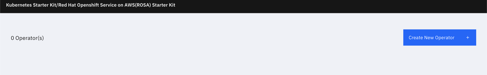

### 6 - Select the Method of creating Operator

Choose the Operator Method as **Ansible Operator from Existing Kubernetes Resources**

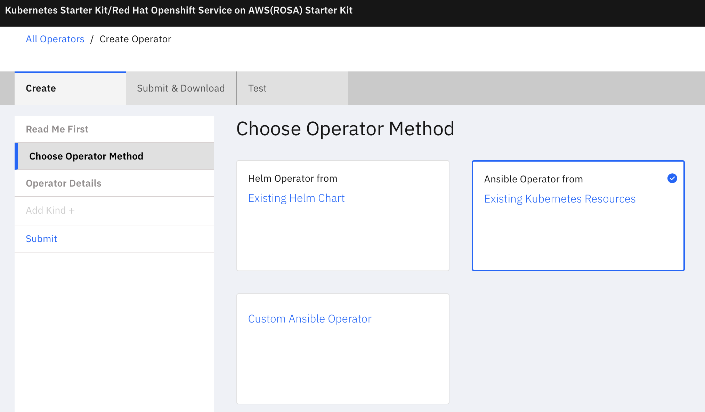

### 7 - Give the operator details and fetch the resources

Give the name of the Operator and other details same as below.

**Operator Name**: `nginx-operator`

**Group Name:** `openlabs`

**Domain Name**: `ibm.com`

**Version**: `v1beta1`

Since we are fetching from the Kubernetes provided out of the box, select **Use local Kubernetes** option and click button **Use local Kubernetes**.

Give the namespace from where resources are to be fetched. For this lab give the namespace as `local-k8s-setup` Click button **Fetch resources** .

 

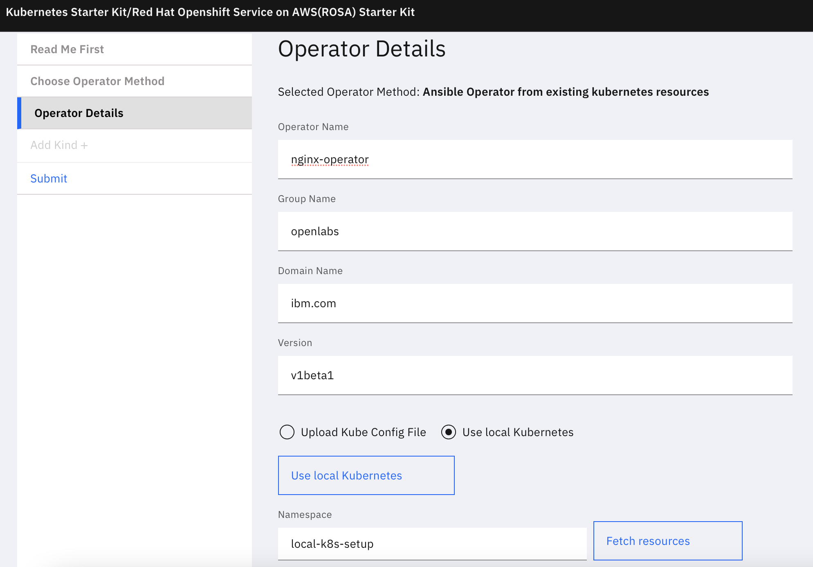

The **Add Kind +** option on the left panel will be enabled only if the resources are fetched successfully.

### 8 - Create a Kind using the K8s resources

Add a new CRD(Kind) using **Add Kind +**

Give the kind name as `InstallApplication` Select the resources that will make up the CRD.

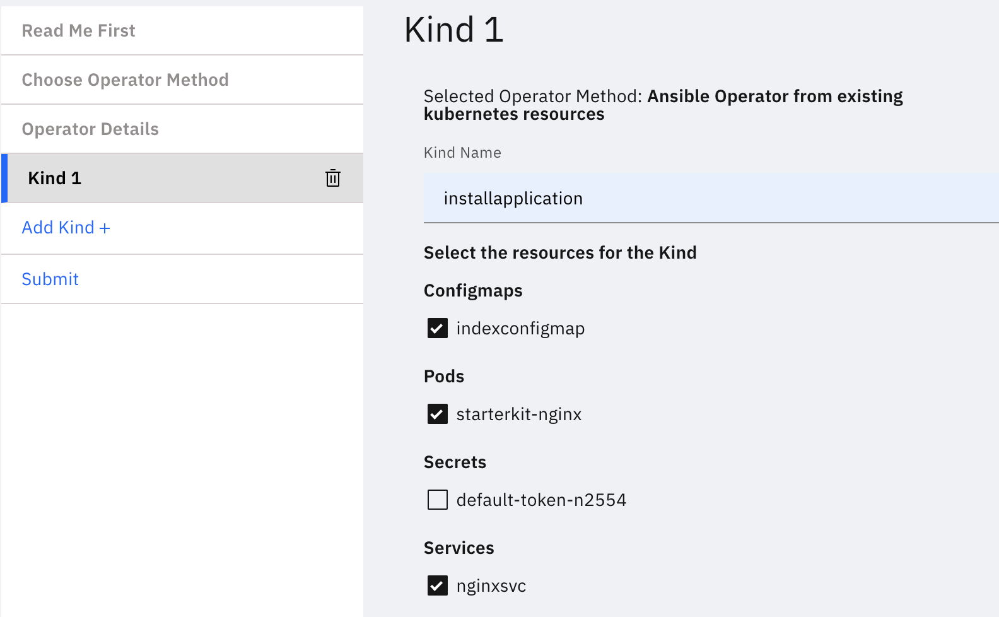

### 9 - Create the Operator

Goto the Submit & Download tab.

Click **Submit Operator** to create the Operator.

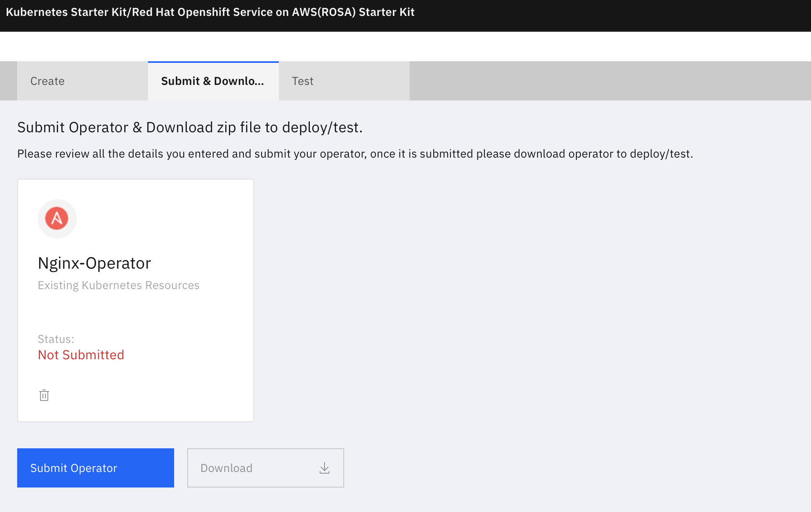

If the Operator is created successfully, you will see a message as below.

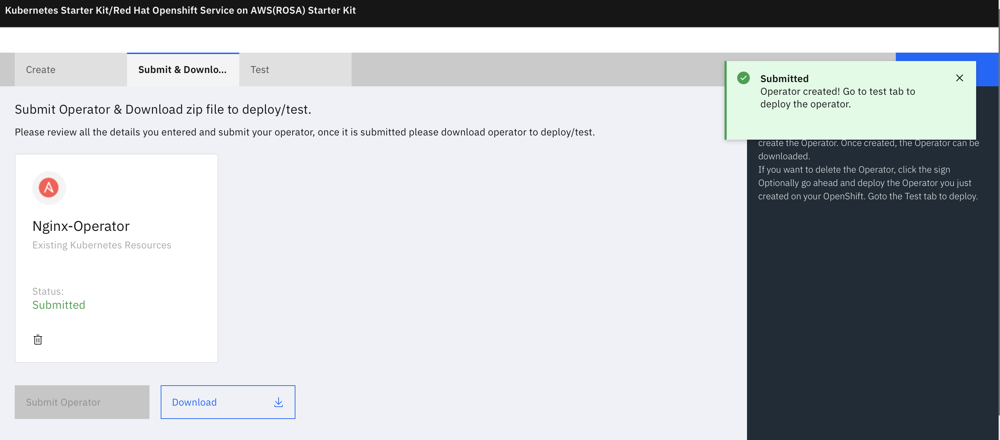


### 10 - Choose the environment to test the Operator

Test the Operator by deploying it on the Local Kubernetes provided out of the box. The test will deploy the Operator and all the Kinds.

Goto the **Test** tab. Select the **Use Default Kubernetes** option. Click **Deploy**.

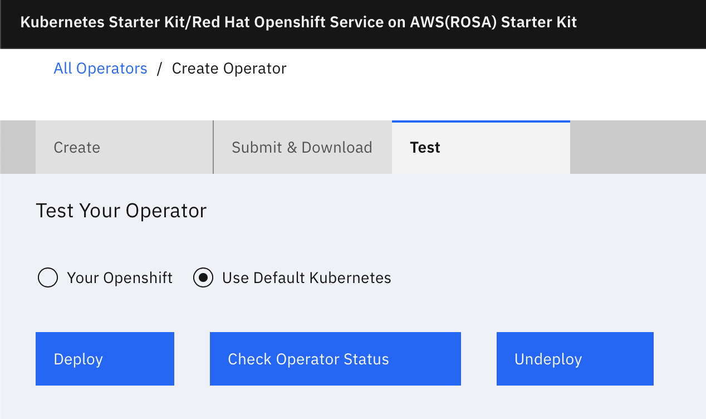

### 11 - Deploy the Operator

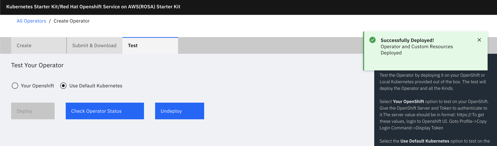


### 12 - Check Operator status

Wait for a ~30 seconds for the deployment to complete.

Click **Check Operator Status** to get the status of the Operator.

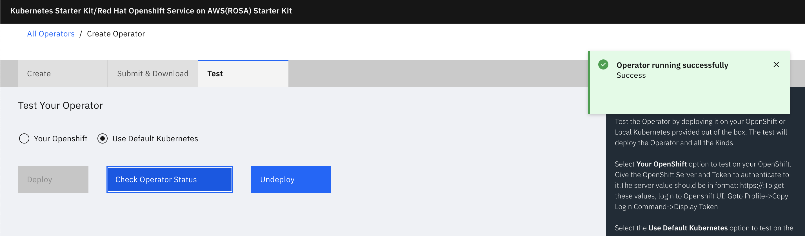

### 13 - Verify the Operator is deployed from the Kubernetes console

Operator is deployed  in the **[operator name]-system** namespace. 

```execute
kubectl get deployment -n nginx-operator-system
```

Get the resources installed by the CRD. It should give the resources selected while creating the Operator. 

```execute
kubectl get pod,svc,configmap -n nginx-operator-system
```

Sample output-

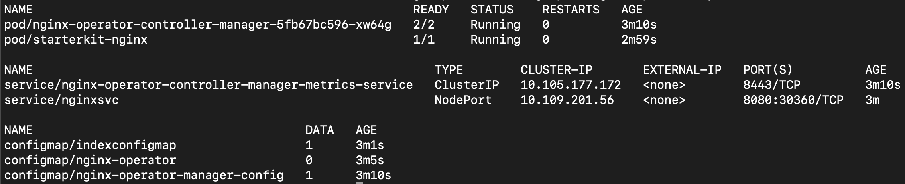

Alternately get the URL of the application you just deployed using the Operator and check from the browser.

```execute
echo "http://$(hostname -I | cut -d' ' -f2):$(kubectl get service nginxsvc -n nginx-operator-system -o custom-columns=:spec.ports[0].nodePort | tail -1)"
```

### 14 - Undeploy the Operator

Click **Undeploy** to un-install the Operator and the CRD.

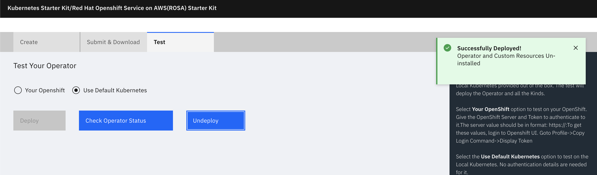

### 15 - Verify the Operator is Undeployed from the Kubernetes console

Check if the namespace created as part of the test still exists.

```execute
kubectl get namespace nginx-operator-system
```

### 16 - Download the Operator Code

Goto the **Submit and Download** tab. Click the **Download** button.

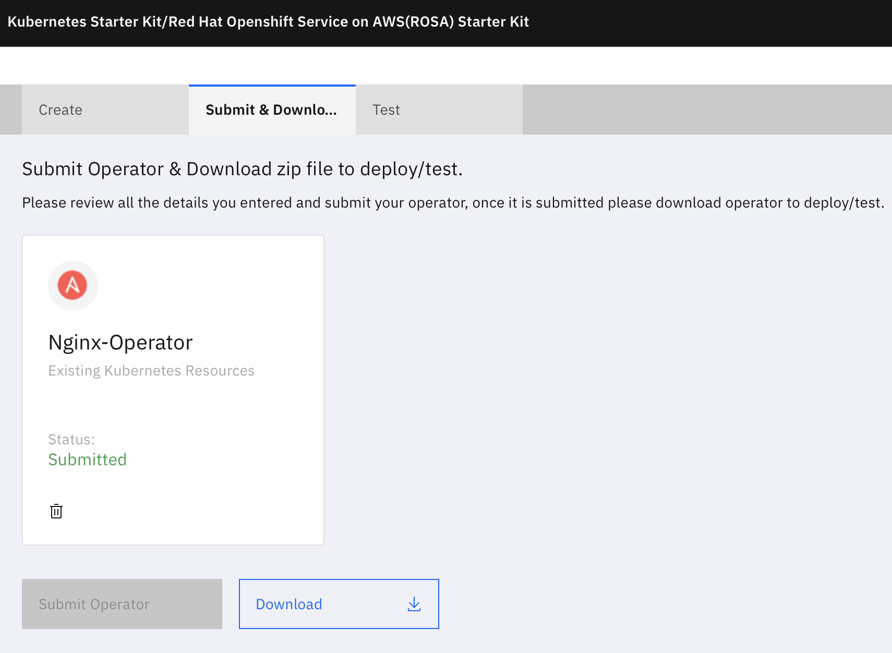

Alternate method

Goto the main page. Click the download icon of the Operator.

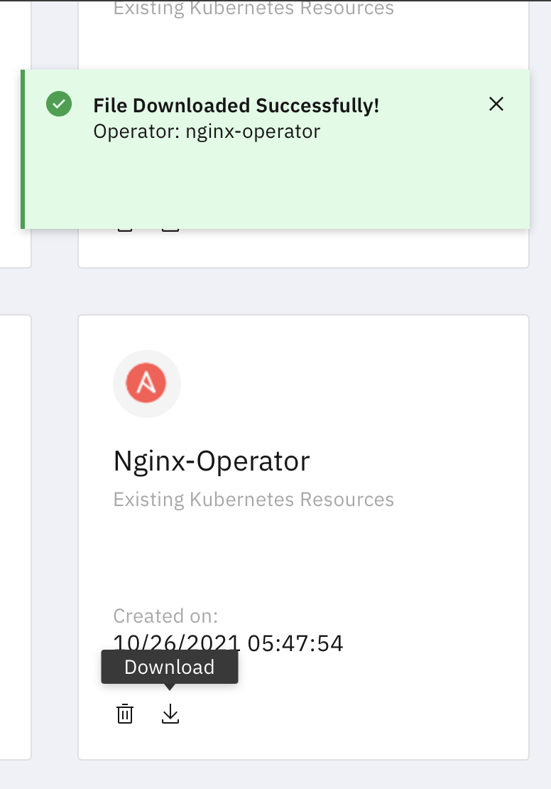